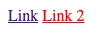
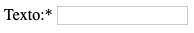

> Antes de começar, lembre-se: **Não faça commit na branch master**

# Desafio CSS
Este conteúdo tem por objetivo auxiliar no aprendizado de CSS e SASS aplicando suas regras em projeto simulado. Serão vários desafios com temáticas específicas, focando em pequenos assuntos para melhor o aprendizado.
Vamos treinar um pouco as técnicas do CSS, focando em uma abordagem dividida em três passos:

* Um protótipo será apresentado
* O HTML estará escrito e não deve ser alterado
* O CSS estará vazio, e ele deve ser escrito para fazer o HTML se comportar corretamente

# Como enviar seu resultado?
* Clone este repositório
* Crie uma branch com seu nome, todo em minusculo: `git checkout -b nome-sobrenome`
* Após finalizado, basta realizar o commit e o push.
* Me envie uma mensagem avisando do seu commit para que eu possa validar seu resultado.

# Desafio 2
Neste desafio, vamos aprender mais sobre as pseudo-classes.
Este é um assunto um pouco mais abrangente, por isso, dividiremos em alguns desafios.

## Desafio Pseudo-classes - Parte 1
Uma **pseudo-classe** CSS é uma palavra-chave adicionada a seletores que especifica um estado especial do elemento selecionado. Por exemplo, `:hover` pode ser usado para alterar a cor de um botão quando o usuário passar o cursor sobre ele.

Vamos abordar em um primeiro momento os pseudo classes comuns para links, botões: `:hover`, `:focus`, `:link`, `:active`, `:active`:

### Hover
Usamos a pseudo-classe `:hover` para modificar um elemento quando o mouse está parado sobre ele.

```css
nav > a {
   color: blue;
}

nav > a:hover {
    color: red;
}
```

### Focus
Usamos a pseudo-classe `:focus` para modificar um elemento quando o foco do navegador está sobre o elemento.

```css
nav > a {
   color: blue;
}

nav > a:focus {
    border: 1px solid red;
}
```

### Active
Usamos a peseudo-classe `:active` para modificar um elemento quando estamos com o mouse posicionado sobre ele e com o botão esquerdo pressionado.

```css
nav > a {
   color: blue;
}

nav > a:focus {
   font-weight: bold;
}
```

### Link
Usamos a pseudo-classe `:link` para identificar os elementos `<a>` que possuem URL associada.
```html
<nav>
  <a href="">Link</a>
  <a href="#1">Link 2</a>
</nav>
```

```css
a:link {
  color: red;
}
```



No exemplo acima, apenas o segundo <a> receberá a cor red pois ele possui um valor atribuido ao atributo `href`.

## Outros elementos
As pseudo-classes podem ser usadas em outros elementos do HTML, tal como `<div>`, `<span>`, `<ul>`, etc.
Algumas pseudo-classes são especificas para um determinado tipo, como `link`, `active` são para os `<a>`, mas outras são mais genéricas e praticamente qualquer elemento aceita.

### Um pouco sobre Before e After
O `:before` e o `:after` devem ser usados em elementos para criar um pseudo-elemento antes ou depois do elemento.
Por padrão, os `:before` e `:after` possuem o `display: inline` então, possuem o comportamento identico a um texto.

```css
p:after {
   content: ' =D';
}
```
```html
<p>Este é um texto de explo apenas</p>
```

O css acima vai adicionar os caracteres `=D` depois de todo `<p>` que encontrar e seu resultado é exibido como abaixo:

```
Este é um texto de explo apenas =D
```

Porém, os `:before` e `:after` podem sofrer mudanças no display, podendo assumir qualquer valor referente o atributo `display`. Deste modo, é possível desenhar antes ou depois de um elemento um circulo, um quadrado, ou mesmo inserir algo mais elaborado como uma seta.

Neste primeiro momento, vamos ver como inserir textos e elementos simples, em um futuro apronfundaremos o estudo dos pseudo-classes `:before` e `:after`.

#### Exemplos
```html
<label for="field">Texto:</label>
<input type="text" id="field" />
```

```css
label:after {
   content: '*';
}
```

**Resultado**



O exemplo acima adiciona o asterisco ao lado da label, podemos ainda adicionar um seletor

### Regras gerais:
O `:before` e o `:after` só funcionam se possuirem o atribuito `content`, caso contrário, ele não será renderizado.